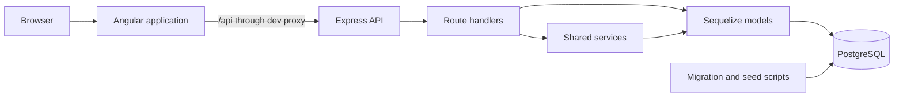
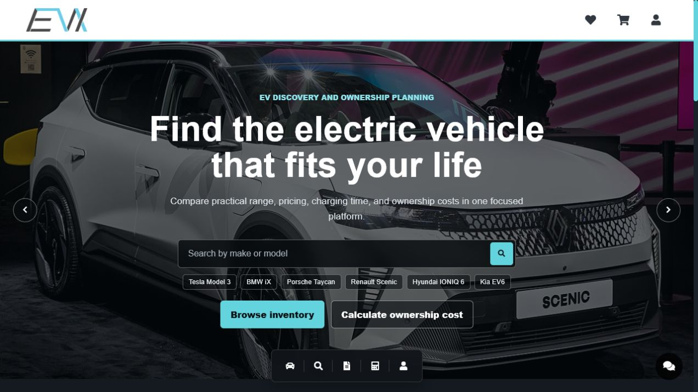
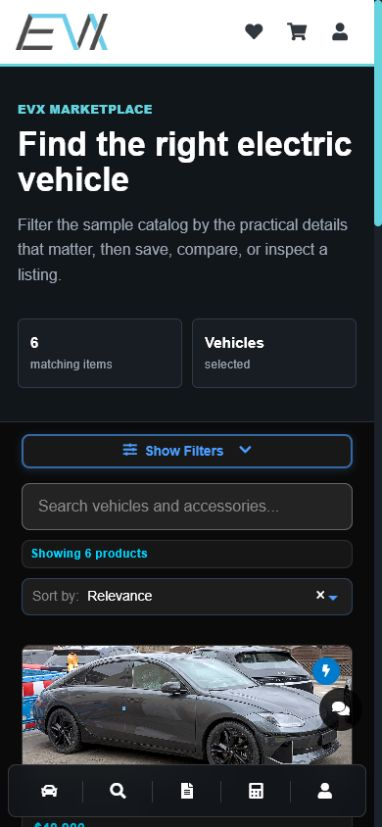
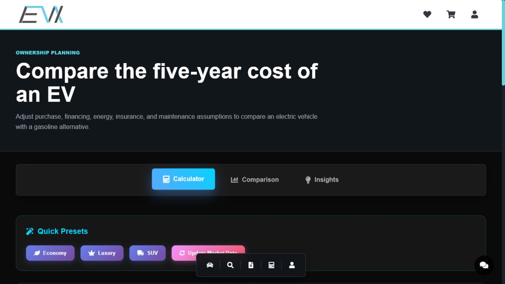

# EVX E-Vehicle Platform

EVX is a full-stack electric vehicle discovery and ownership-planning platform. It combines a responsive Angular interface with an Express API and PostgreSQL database so users can browse EVs, compare practical specifications, estimate total ownership cost, save favorites, explore accessories, and learn through curated resources.

## Business Use Case

EV shoppers often move between listing sites, spreadsheets, charging guides, and cost calculators. EVX brings those decisions into one experience:

- Discover vehicles and accessories with meaningful filters.
- Compare range, price, charging time, condition, brand, and dealer details.
- Estimate total cost of ownership using visible assumptions.
- Save a shortlist and maintain a lightweight cart.
- Read practical EV articles, courses, and video resources.
- Continue a sales or support conversation through a responsive chat interface.

## Features

- Responsive EV catalog with advanced filtering, sorting, and pagination
- Vehicle and accessory detail views
- Saved-item workflow backed by the API with a local fallback
- Total cost of ownership calculator
- Shopping cart state management
- Educational news, videos, and courses
- Desktop and mobile chat experience
- PostgreSQL-backed catalog and content data
- Versioned database migrations and repeatable sample-data scripts
- Health checks, consistent JSON errors, request logging, CORS, and Helmet
- Server-side rendering support through Angular SSR

## Tech Stack

| Layer | Technology |
| --- | --- |
| Frontend | Angular 19, TypeScript, RxJS, PrimeNG, Bootstrap |
| Backend | Node.js, Express 4 |
| Database | PostgreSQL 17, Sequelize 6 |
| Tooling | Angular CLI, Node test runner, Docker Compose, concurrently |
| Delivery | Environment-based configuration and production Angular builds |

## Architecture



The frontend calls relative `/api` URLs. During local development, Angular proxies those requests to `http://localhost:3001`. Express validates query parameters, applies pagination and sorting, reads through Sequelize models, and returns stable JSON response shapes.

## Project Structure

```text
EVX-Web-main/
|-- src/app/
|   |-- components/       Shared navigation, search, footer, and UI tools
|   |-- pages/            Route-level product experiences
|   |-- services/         API, cart, likes, image, and route state
|   `-- types/            Shared frontend contracts
|-- src/assets/           Local UI and licensed vehicle photography
|-- be/
|   |-- models/           Sequelize table definitions and relationships
|   |-- routes/           Express endpoint modules
|   |-- src/              App startup, configuration, migrations, middleware
|   |-- scripts/          Development sample-data commands
|   |-- data/             Vehicle and accessory fixtures
|   `-- tests/            API contract tests
|-- docs/                 Screenshots and asset attribution
|-- scripts/              Repository setup helpers
`-- proxy.conf.json       Angular-to-API development proxy
```

## API Overview

The API base URL is `http://localhost:3001/api`.

| Area | Main endpoints |
| --- | --- |
| Health | `GET /health` |
| Vehicles | `GET /vehicles`, `GET /vehicles/hero`, `GET /vehicles/featured`, `GET /vehicles/:id` |
| Accessories | `GET /accessories`, `GET /accessories/featured`, `GET /accessories/:id` |
| Combined catalog | `GET /items` |
| Filters | `GET /categories`, `GET /categories/brands`, `GET /categories/filters` |
| Dealers | `GET /dealers`, `GET /dealers/vehicles`, `GET /dealers/accessories` |
| Favorites | `GET /item-likes/user/:userId`, `POST /item-likes/toggle`, `POST /item-likes/check-multiple` |
| Resources | `GET /news`, `GET /videos`, `GET /courses` and their detail endpoints |

See [be/API_CONTRACT.md](be/API_CONTRACT.md) for request parameters and response examples.

## Database Tables

| Table | Purpose |
| --- | --- |
| `vehicles` | EV specifications, pricing, imagery, dealer details, and features |
| `accessories` | Charging, interior, safety, and other EV accessories |
| `users` | User identities for saved-item ownership |
| `user_item_likes` | Saved vehicles and accessories by user |
| `news` | Educational EV articles |
| `videos` | Curated educational video metadata |
| `courses` | EV workshops and learning content |
| `SequelizeMeta` | Applied migration history |

## Local Setup

### Prerequisites

- Node.js 20 LTS
- npm 10+
- Docker Desktop with Docker Compose, or a local PostgreSQL 17 instance

### Quick Start With Docker

```bash
git clone <repository-url>
cd EVX-Web-main
npm run setup
npm run db:up
npm run db:migrate
npm run db:seed
npm run dev
```

Open:

- Frontend: `http://localhost:4200`
- API health: `http://localhost:3001/api/health`

`npm run setup` installs frontend and backend packages and creates `be/.env` from the checked-in example when it does not already exist.

### Using an Existing PostgreSQL Installation

1. Create a PostgreSQL database and login role.
2. Copy `be/.env.example` to `be/.env`.
3. Update the database values in `be/.env`.
4. Run `npm run db:migrate` and `npm run db:seed`.
5. Run `npm run dev`.

### Useful Commands

| Command | Purpose |
| --- | --- |
| `npm run dev` | Start Angular and Express together |
| `npm run start:frontend` | Start only Angular on port 4200 |
| `npm run start:backend` | Start only Express on port 3001 |
| `npm run db:migrate` | Apply pending database migrations |
| `npm run db:seed` | Reset and load development sample data |
| `npm run db:down` | Stop the Docker PostgreSQL service |
| `npm run test:backend` | Run API contract tests |
| `npm run build` | Create a production Angular build |
| `npm run check` | Run backend tests and the frontend build |

## Environment Variables

Backend variables live in `be/.env`. Never commit that file.

| Variable | Example | Description |
| --- | --- | --- |
| `PORT` | `3001` | Express API port |
| `NODE_ENV` | `development` | Runtime mode |
| `CORS_ORIGINS` | `http://localhost:4200` | Comma-separated allowed frontend origins |
| `DB_HOST` | `localhost` | PostgreSQL hostname |
| `DB_PORT` | `5432` | PostgreSQL port |
| `DB_NAME` | `evx_db` | Database name |
| `DB_USER` | `evx_user` | Database role |
| `DB_PASSWORD` | `evx_password` | Local development password |

## Sample Data

The development seed includes six accurately pictured EV models, ten accessories, a guest user, educational articles, verified EV videos, and workshop/course records. Seeding is blocked when `NODE_ENV=production`.

## Screenshots

### Home and featured inventory



### Advanced search on mobile



### Total cost of ownership calculator



## Testing

```bash
npm run test:backend
npm run build
```

The backend tests cover the health contract, JSON 404 behavior, input validation, and pagination limits. The production frontend build validates Angular templates, TypeScript, lazy route chunks, and SSR output.

## Image Attribution

Vehicle photos are real photographs sourced from Wikimedia Commons under Creative Commons licenses. Full creator, source, and license details are listed in [docs/IMAGE_CREDITS.md](docs/IMAGE_CREDITS.md).

## Future Improvements

- Add authenticated user accounts and authorization roles.
- Upgrade Angular to the current supported major in a dedicated migration.
- Replace the guest identity with token-based sessions.
- Persist cart and chat conversations through dedicated API endpoints.
- Add automated Angular component and end-to-end tests.
- Add cloud object storage for catalog media.
- Add deployment workflows for the frontend, API, and managed PostgreSQL.
- Add dealer onboarding and inventory administration as a separate bounded application.
